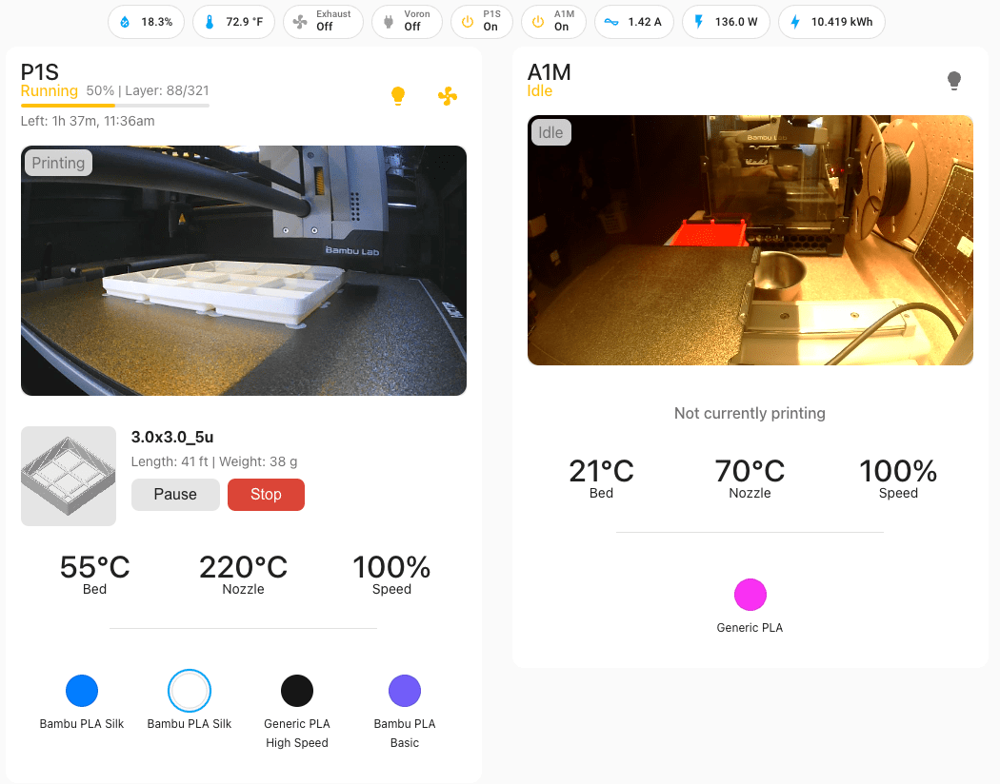
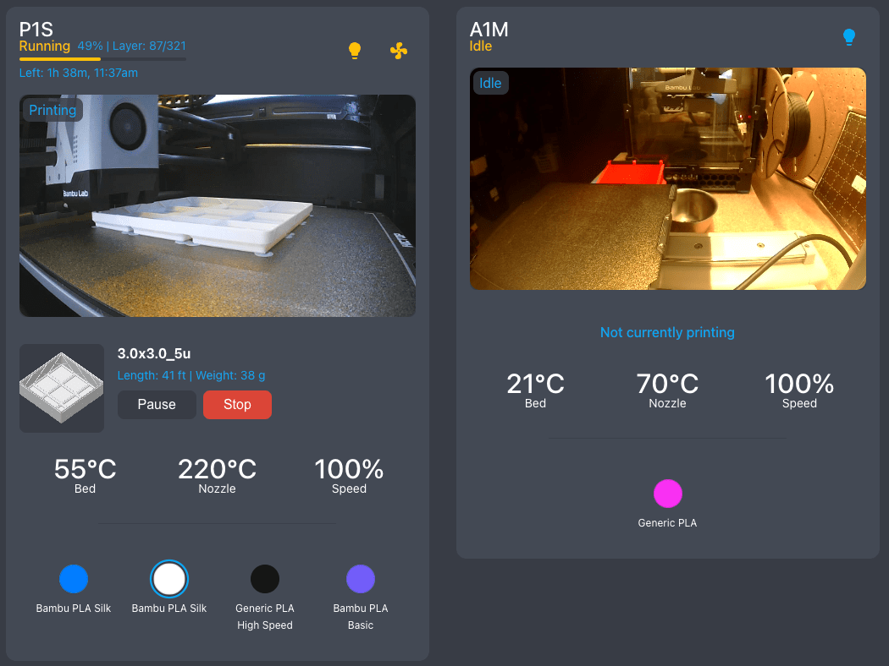

# PrintWatch Card

> A feature-rich, printer-agnostic Home Assistant card for monitoring and controlling 3D printers. Get real-time updates on print progress, temperatures, material status, and more with a sleek, user-friendly interface.

Supports multiple 3D printer models including:

- **Bambu Lab P1S** (native support via ha-bambulab integration)
- **Elegoo Centauri Carbon** (resin printer)
- Any custom 3D printer with Home Assistant sensors

[](https://opensource.org/licenses/MIT)
[](https://github.com/drkpxl/printwatch-card/releases/latest)
[](https://github.com/hacs/default)
[](https://github.com/drkpxl/printwatch-card/actions/workflows/validate.yaml)
[](https://github.com/drkpxl/printwatch-card/stargazers)
[](https://github.com/drkpxl/printwatch-card/forks)

## Features

- 🖨️ **Multi-Printer Support** - Works with any 3D printer via Home Assistant entities
- 🎥 **Live camera feed**
  - Uses native HA streaming for `camera.*` entities (e.g. Generic Camera)
  - Uses configurable refresh rate for `image.*` entities
- 📊 **Print progress tracking** with layer count and estimated completion time
- 🎨 **Material/Filament status** visualization (customizable for any printer)
- 💡 **Quick controls** for chamber light and auxiliary fan (optional)
- ⏯️ **Print control buttons** (pause/resume/stop) with confirmation dialogs
- 🎛️ **Speed profile monitoring** and control (if supported by printer)
- ⚡ **Local API support** (where applicable)
- 🌑 **Native Theme support** - adapts to light and dark modes
- 🌡️ **Real-time temperature monitoring** and control for bed and nozzle (if available)
- 📷 **Print preview image** display (if available)
- 🏷️ **Print metadata** - Display print weight and length details
- 🌍 **Localization support**:
  - English
  - Russian
  - German
  - Danish

## Screenshots

### Light Mode



### Dark Mode



## Prerequisites

- Home Assistant 2023.8 or later
- Appropriate printer integration configured in Home Assistant (examples below)
- Required entities set up (see Configuration section)
- For streaming: the built-in Home Assistant `stream` integration must be enabled

### Supported Printer Integrations

- **Bambu Lab printers**: [ha-bambulab](https://github.com/greghesp/ha-bambulab)
- **Elegoo printers**: Any integration that exposes printer state as Home Assistant entities
- **Custom printers**: Configure manually with your printer's integration

## Installation

### HACS (Recommended)

1. Open HACS in Home Assistant
2. Click on "Frontend" section
3. Click the "+ Explore & Download Repositories" button
4. Search for "PrintWatch Card"
5. Click "Download"
6. Restart Home Assistant

### Manual Installation

1. Navigate to HACS
2. Tap 3 buttons in top right and select "Custom repositories"
3. Paste `https://github.com/drkpxl/printwatch-card` and select `dashboard`
4. Save
5. Select printwatch-card in HACS listing and click download
6. Restart Home Assistant
7. Clear browser cache if you were using a previous version

## Configuration

### Quick Start via GUI

The card is now fully configurable through Home Assistant's Dashboard Editor UI!

1. Add the card to your dashboard
2. Click "Edit" on the card
3. Select your printer model from the dropdown:
   - **Bambu Lab P1S** - Auto-configures common entities for Bambu Lab printers
   - **Elegoo Centauri Carbon** - Optimized for Elegoo resin printers
   - **Custom** - Define your own entity mappings
4. Select your printer's entities using the entity pickers
5. Optionally customize visibility options

### YAML Configuration (Advanced)

All configuration can be done through the GUI, but YAML mode is still supported for advanced users:

#### Bambu Lab P1S Example

```yaml
type: custom:printwatch-card
printer_preset: bambu-lab-p1s
title: My Bambu Lab P1S
general:
  status: sensor.bambu_lab_status
  stage: sensor.bambu_lab_stage
  progress: sensor.bambu_lab_progress
  remaining_time: sensor.bambu_lab_remaining_time
  speed_profile: select.bambu_lab_speed_profile
camera:
  entity: camera.bambu_lab_camera
  refresh_rate: 1000
control:
  pause_button: button.bambu_lab_pause
  resume_button: button.bambu_lab_resume
  stop_button: button.bambu_lab_stop
  chamber_light: light.bambu_lab_chamber_light
  fan: fan.bambu_lab_cooling_fan
model:
  name: sensor.bambu_lab_print_name
  preview: image.bambu_lab_preview
  length: sensor.bambu_lab_print_length
  weight: sensor.bambu_lab_print_weight
temperature:
  bed: sensor.bambu_lab_bed_temperature
  bed_number: number.bambu_lab_bed_target_temperature
  nozzle: sensor.bambu_lab_nozzle_temperature
  nozzle_number: number.bambu_lab_nozzle_target_temperature
filament:
  ams_slots:
    - sensor.bambu_lab_ams_slot_1
    - sensor.bambu_lab_ams_slot_2
    - sensor.bambu_lab_ams_slot_3
    - sensor.bambu_lab_ams_slot_4
```

#### Elegoo Centauri Carbon Example

```yaml
type: custom:printwatch-card
printer_preset: elegoo-centauri-carbon
title: My Elegoo Centauri Carbon
general:
  status: sensor.elegoo_status
  stage: sensor.elegoo_stage
  progress: sensor.elegoo_progress
  remaining_time: sensor.elegoo_remaining_time
camera:
  entity: camera.elegoo_camera
  refresh_rate: 2000
control:
  pause_button: button.elegoo_pause
  resume_button: button.elegoo_resume
  stop_button: button.elegoo_stop
model:
  name: sensor.elegoo_print_name
  preview: image.elegoo_preview
temperature:
  nozzle: sensor.elegoo_tank_temperature
filament:
  ams_slots:
    - sensor.elegoo_resin_tank
```

#### Custom Printer Configuration

```yaml
type: custom:printwatch-card
printer_preset: custom
title: My Custom Printer
general:
  status: sensor.your_printer_status
  stage: sensor.your_printer_stage
  progress: sensor.your_printer_progress
  remaining_time: sensor.your_printer_time_remaining
camera:
  entity: camera.your_printer_camera
control:
  pause_button: button.your_printer_pause
  resume_button: button.your_printer_resume
  stop_button: button.your_printer_stop
model:
  name: sensor.your_printer_job_name
```

### Configuration Options

#### General Settings

- `title` (required): Display name for your printer
- `printer_preset`: Preset configuration to use (options: `bambu-lab-p1s`, `elegoo-centauri-carbon`, `custom`)
- `general.status`: Entity providing printer status
- `general.stage`: Entity providing current print stage
- `general.progress`: Entity providing progress percentage (0-100)
- `general.remaining_time`: Entity providing remaining time in seconds
- `general.speed_profile`: Select entity for print speed profile (optional)

#### Camera Settings

- `camera.entity`: Camera or image entity for live preview
- `camera.refresh_rate`: Update interval in milliseconds (default: 1000)

#### Control Buttons

- `control.pause_button`: Button entity to pause printing
- `control.resume_button`: Button entity to resume printing
- `control.stop_button`: Button entity to stop printing
- `control.chamber_light`: Light or switch entity for chamber lighting (optional)
- `control.fan`: Fan entity for cooling/circulation (optional)

#### Temperature Monitoring

- `temperature.bed`: Sensor entity for bed temperature (optional)
- `temperature.bed_number`: Number entity to set bed target temperature (optional)
- `temperature.nozzle`: Sensor entity for nozzle/hotend temperature (optional)
- `temperature.nozzle_number`: Number entity to set nozzle target temperature (optional)

#### Model Information

- `model.name`: Sensor entity for current print name
- `model.preview`: Image entity for print preview (optional)
- `model.length`: Sensor entity for print length (optional)
- `model.weight`: Sensor entity for print weight (optional)

#### Filament/Material Status

- `filament.ams_slots`: Array of sensor entities for material/filament status (optional)

#### Visibility Options

```yaml
show:
  title: true # Show card title
  camera: true # Show camera feed
  control: true # Show print controls
  ams_slots: true # Show filament/material status
```

## Adding Support for Other Printers

This card is designed to be easily customizable for any 3D printer with Home Assistant integration. To add a new printer preset:

1. Identify the entity IDs used by your printer's Home Assistant integration
2. Open `src/constants/printer-presets.js`
3. Add a new preset object following the existing patterns
4. Submit a pull request or open an issue to request the preset be added

Example template for a new printer:

```javascript
'my-printer-model': {
    name: 'My Printer Model',
    description: 'Description of your printer',
    entities: {
      general: {
        status: 'sensor.my_printer_status',
        stage: 'sensor.my_printer_stage',
        // ... other entities
      },
      // ... other categories
    }
  }
```

## Troubleshooting

### Common Issues

1. **Card not appearing**

   - Check that all required entities exist and are correctly named in your Home Assistant instance
   - Verify resources are properly loaded in HA (check browser console for errors)

2. **Camera feed not updating**

   - Ensure camera entity is properly configured and accessible
   - Check that image updates are enabled in Home Assistant
   - Try increasing the `refresh_rate` value

3. **Controls not working**

   - Verify that your user has proper permissions for the button/switch entities
   - Check that button entities are available and not in an error state
   - Ensure the service calls are supported by your printer integration

4. **Preset values not being used**

   - Click "Reset to Preset Values" button in the editor
   - Ensure you have the correct preset selected
   - Check that the preset matches your integration's entity naming

5. **Localization issues**
   - Verify your Home Assistant language setting
   - Some translations are community-provided; contributions welcome!

## Contributing

Contributions are welcome! Please read our [Contributing Guide](CONTRIBUTING.md) for details on our code of conduct and the process for submitting pull requests.

## Support

If you're having issues, please:

1. Check the Troubleshooting section above
2. Search existing [GitHub issues](https://github.com/drkpxl/printwatch-card/issues)
3. Create a new issue with:
   - Your printer model and integration
   - Entity IDs you're using
   - Error messages from the browser console
   - Screenshots if applicable

## License

This project is licensed under the MIT License - see the [LICENSE](LICENSE) file for details.

## Acknowledgments

- [Greg Hesp](https://github.com/greghesp/ha-bambulab) maker of [ha-bambulab](<(https://github.com/greghesp/ha-bambulab)>) without this plugin wouldn't work
- Thanks to all P1S users who provided feedback and testing
- Inspired by the great Home Assistant community

---

If you find this useful I am addicted to good coffee.

<a href="https://www.buymeacoffee.com/drkpxl" target="_blank"></a>
